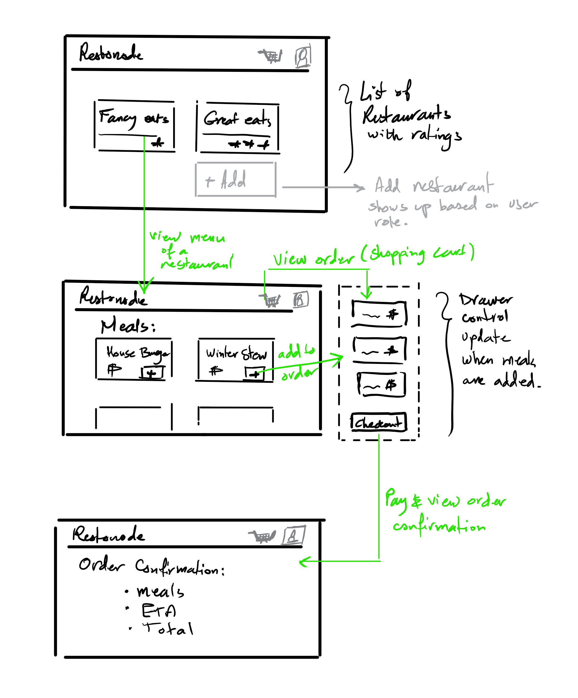

# restonode.frontend

## Framework:

I chose React as a frontend framework with the technical motivation to produce highly testable code without the usual hassle of testing react components that I have seen in many other projects. Redux is also used for state management. My technical approach to testing and implementing react/redux is:

- Do not **mount** connected components in tests, rather test mapStateToProps and mapStateToDispatch as pure functions and export the wrapped component along side its container so that it can be **shallow** tested without the need to mock the store.
- Avoid elaborate assertions on html and styles in component tests because it yields very brittle tests, rather, assert on rendered code properties without styles.
- If using redux or other state management, start with designing the action creators. Understanding what actions you application and its components will dispatch help in designing you application state and producing an object graph that can be split up across multiple reducers

`create-react-app` is used to scaffold the app. The codebase is written entirely in `TypeScript`. 

## UI mockup

This simple sketch show the main components of the UI:
- A user profile
- An Orders cart (shopping cart)
- Restaurant view, a list of restaurants and their ratings
- Menu view, or meals view of a selected restaurant
- A floating drawer-like components to show the current orders/meals the user has selected
- An order confirmation page
- For users who can create restaurants, a create restaurant link will be visible
- For users who can create restaurants, a create meal link will be visible.

***the requirements are kept to a minimal to showcase the technical approach and implementation, there are many edge cases and other variations (i.e. remove order, sort search, etc...) that are not a part of this solution.***



## running the app
`create-react-app` standard `start` and `build` scripts are used
```bash
yarn start
yarn build
yarn test
yarn test --coverage 
```

